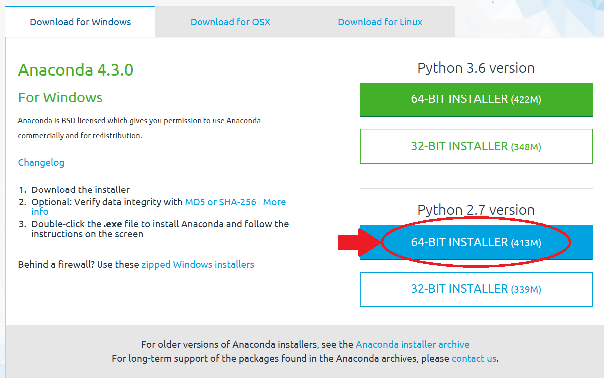

# SEBAL toolbox   

_Surface Energy Balance Algorithm for Land_

---

## about SEBAL

---

## Installation

There are several packages available, which include python. For SEBAL the python package of Anaconda is recommended. The great advantage of using the standard Anaconda package is that most of the commonly used modules are included in the package. Alternatively, these modules can be installed separately by the user if a different package than Anaconda is preferred.

### Install Anaconda

Anaconda can be downloaded from: [http://continuum.io/downloads](http://continuum.io/downloads). It is recommended to download  the 64 bits version, because this will increase the calculation capacity enormously. However, be sure that your computer/laptop is a 64 bits computer/laptop. 

The SEBAL python codes are made for python version 2.7 for Windows operating systems. It is therefore necessary to download this version of python for running SEBAL. Major changes are made to the python codes and functions if you compare 2.7 with 3+ versions. It is therefore not possible to run all the SEBAL codes in python 3+ versions without doing some changes to the code.

 

After downloading Anaconda you can run the installation of Anaconda by double-click the executable file and follow the automatic installation steps. Choose a logical location for the installation, a logical location is a directory without spaces and preferably near the root folder (C: or D:). In the remaining of this document this directory will be called $HOME. 
The Anaconda package also includes Spyder, which is the IDE (Integrated Development Environment). This is a layout for writing and running python scripts.

---

## SEBAL manual

---

## Troubleshoot

---

>>>>>>> origin/master
